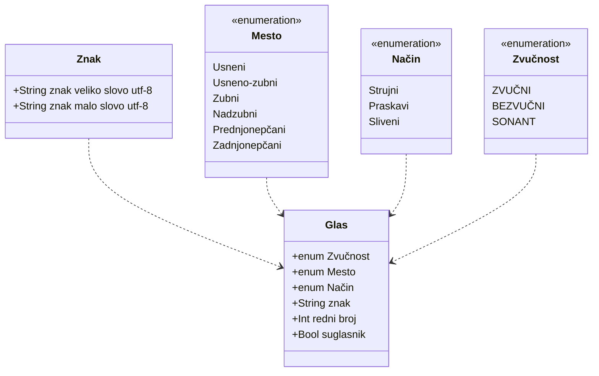

# Azbuka

## Fonetika

Fonetika je deo nauke o jeziku koji proučava glasove i njihove promene. U našem jeziku svakom glasu odgovara određeno slovo, pa zato kažemo da je naš pravopis fonetski.

### Glasovi

Sve glasove možemo podeliti na **samoglasnike** i **suglasnike**.

#### Samoglasnici:

A, E, I, O, U. Oni su nosioci sloga i akcenta u reči.

#### Suglasnici (konsonanti):

svi osim pet samoglasnika: B, V, G, D, Đ, Ž, Z, J, K, L, M, LJ, N, NJ, P, R, S, T, Ć, F, H, C, Č, DŽ, Š.

#### Glasovi:

R, L, N, takođe mogu biti nosioci sloga, R kada nema do sebe vokal, odnosno neki od samoglasnika, a L i N u rečima stranog porekla. Na primer: pr-vi, prst, tr-ska; Vl-ta-va, Nju-tn, bi-ci-kl.

### Podela samoglasnika

Samoglasnike dalje delimo, prema položaju jezika u usnoj duplji prilikom njihovog izgovora na visoke, srednje i niske, odnosno prednje, srednje i zadnje.

| VOKALI  | PREDNJI | SREDNJI | ZADNJI |
| ------- | :-----: | :-----: | :----: |
| VISOKI  |    I    |         |   U    |
| SREDNJI |    E    |         |   O    |
| NISKI   |         |    A    |        |

Na primer, na pitanje: Koji je visoki samoglasnik (vokal) zadnjeg reda? – odgovor je: U.

Srednji vokal prednjeg reda: E.

Niski vokal srednjeg reda: A.

### Podela suglasnika

#### Podela suglasnika po zvučnosti:
* ZVUČNI: B G D Z Ž Đ DŽ
* BEZVUČNI: P K T S Š Ć Č F H C
* Sonanti: M, V, R, L, N, LJ, NJ, J.

#### Prema mestu izgovora (tvorbe):
* Usneni (labijalni): P, B, M.
* Usneno-zubni (labiodentalni): F, V.
* Zubni: Z, D, S, T, C.
* Nadzubni (alveolarni): R, L, N.
* Prednjonepčani (palatalni):
  * Meki: J, NJ, LJ, Đ, Ć.
  * Tvrdi: Č, DŽ, Ž, Š.  
* Zadnjonepčani (velarni): K, G, H

#### Prema načinu izgovora (tvorbe):
* Strujni (frikativni): F, S, Z, Š, Ž, H.
* Praskavi (eksplozivni): B, P, D, T, G, K.
* Sliveni (afrikate): C, DŽ, Č, Đ, Ć.

# Podela reči na slogove

## Slog i nosioci sloga
Slog je glasovna jedinica koja se ostvaruje jednim izgovornim (artikulacionim) zahvatom. Nosioci sloga mogu biti samoglasnici (vokali) a, e, i, o, u i sonanti r, l, n. Reč ima onoliko slogova koliko ima samoglasnika. Granica sloga može biti iza vokala (za-mi-šlja-ti), ali i iza suglasnika (mar-ljiv).

Slog može da bude i samo jedan glas, ali to mora da bude vokal (a-vi-on), a može i cela reč da se sastoji od samo jednog sloga (prst). Reč koja se sastoji od jednog sloga naziva se jednosložna reč (san), reč sa dva sloga je dvosložna (sno-vi), sa tri – trosložna (spa-va-ti), a sa četiri – četvorosložna (spa-va-li-ca).

Slogovi mogu biti:
  1. **otvoreni** – ako se završavaju na samoglasnik:
    * do-ne-ti,
    * li-va-da,
    * ma-ma,
    * po-lja-na;

  2. **zatvoreni** - ako se završavaju na suglasnik:
    * jed-nak,
    * lom-ljiv,
    * slom-ljen,
    * tram-vaj.

## Sonanti kao nosioci sloga

  1. Sonant R je nosilac sloga:
      * u jednosložnim rečima: brz, crn, krst, trn, tvrd, vrt;
      * u sredini reči između dva suglasnika: dr-vo, dr-ža-ti, tr-ka, tr-lja-ti;
      * na početku reči ispred suglasnika: r-đa-ti, r-vač, r-za-ti;
      * kad se nalazi ispred samoglasnika o, koje je postalo od suglasnika l: grlo – gr-oce.

  1. Sonant L kao nosilac sloga se najčešće javlja u rečima stranog porekla: bi-ci-kl, mo-no-kl, Vl-ta-va.

  1. Sonant N kao nosilac sloga takođe se najčešće javlja u rečima stranog porekla: I-bn, I-dn, Nju-tn.

## Suglasničke grupe

##### Pravila podele reči na slogove kad su nosioci sloga suglasnici:

  1. ako grupu suglasnika čine dva sonanta (j, l, lj, m, n, nj, r, v), granica sloga je između njih.
      
      * Na primer: or-la, po-lom-ljen, pr-ljav;

  1. ako je u grupi suglasnika na prvom mestu praskavi suglasnik (b, d, g, k, p, t), a drugi nije j, l, lj, r, v, granica sloga je između njih.
      
      * Na primer: lep-tir, lop-ta, sred-stvo;

  1. ako je u grupi suglasnika na drugom mestu glas j, l, lj, r, v, granica sloga je ispred njih.
      
      * Na primer: je-dva, sve-tlost, to-pljen, vi-dra.

  1. kad se u sredini reči nađe grupa suglasnika, od kojih je na prvom mestu neki strujni (f, h, s, š, z, ž) ili sliveni (c, č, ć, dž, đ), granica sloga je ispred te grupe.
      
      * Na primer: če-šće, gro-žđe, la-sta, ma-čka, vo-ćka.

## Granica sloga

#### Granica sloga može biti:

1. **fonetska** (nastaje usled fonetskih osobina glasa): o-du-zi-ma-ti, ra-zmi-sli-ti;
1. **semantička** ili psihološka (kad osećamo da je nešto prefiks): od-u-zi-ma-ti, raz-mi-sli-ti.

**U srpskom jeziku, prednost se daje semantičkoj granici sloga.**